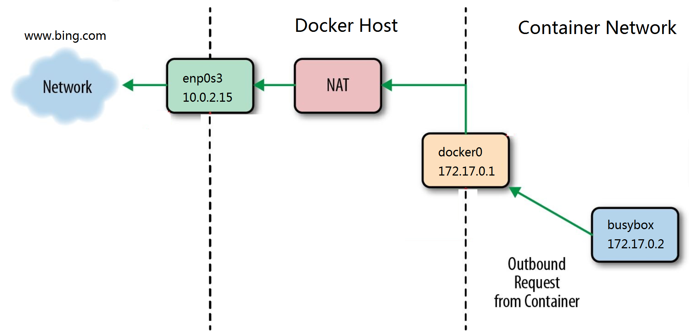

# Tìm hiểu Docker
## 1.Tìm hiểu Docker là gì?
Docker là một ứng dụng nguồn mở cho phép độc lập triển khai giữa các ứng dụng và cơ sở hạ tầng đối với các nhà pháp triển và mở ra tiềm năng tạo nên mô hình cho sự hợp tác và đổi mới hơn
* Docker giải quyết vấn đề khi mà các doanh nghiệp ngày nay đang chịu áp lực phải chuyển đổi số kỹ thuật nhưng bị hạn chế bởi các ứng dụng và cơ sở hạ tầng hiện tại đồng thời hợp lý hóa danh mục cloud
## 2. Chức năng, vai trò của Docker?
* Cho phép phát triển, di chuyển và chạy các ứng dụng dựa vào công nghệ ảo hóa container trong linux.
* Tự động triển khai các ứng dụng bên trong các container bằng cách cung cấp thêm 1 lớp trìu tượng và tự động hóa việc ảo hóa mực hệ điều hành
* Docker có thể sử dụng trên cả 3 hệ điều hành phổ biến: Windows, Linux, MacOS
* Lợi ịch của Docker bao gồm:
    * Nhanh trong việc triển khai, di chuyển, khởi động container
    * Bảo mật
    * LightWeight (Tiết kiệm disk & CPU)
    * Mã nguồn mở 
    * Hỗ trợ API để giao tiếp với container
    * Phù hợp trong môi trường làm việc đòi hỏi phải liên tục tích hợp và triển khai các dịch vụ, phát triển cục bộ, các ứng dụng multi-tier 
## 3. Các khái niệm cần biết khi sử dụng Docker
### 3.1 Image
* Image trong Docker hay còn được gọi là mirror. Là một template có sẵn (Hoặc có thể tự tạo) với các chỉ dẫn dùng để tạo ra các container.
* Được xây dựng từ một loạt các layers. Mỗi layer là một kết quả đại diện một lệnh trong docker file.
* Lưu trữ dưới dạng read-only Template
### 3.2 Registry 
* Docker Registry là nơi lưu trữ các image với 2 chế độ là Private và Public
* Là nơi cho phép chia sẻ các Image Template để sử dụng trong quá trình làm việc với Docker
### 3.2 Volumes
* Volume trong Docker là nơi dùng để chia sẻ dữ liệu cho các container
* Có thể sử dụng volume với 2 trường hợp như sau:
    * Chia sẻ giữa các container với container
    * Chia sẻ giữa các container với host
### 3.4 Container
* Docker Container là một thể hiện của Docker Image với các thao tác cơ bản để sử dụng quả CLI như start, stop, restart hay delete . . .
* Container Image là một gói phần mềm thực thi LightWeight, độc lập và có thể thực thi được bao gồm mọi thứ cần thiết để chạy được nó: Code, runtime, system tools, system librarym, setting,... Các ứng dụng có sẵn cho cả Linux và Windows, các container sẽ luôn chạy ổn định bất kể môi trường.

* Container và VM có sự cách ly và phân bổ tài nguyên tương tự, nhưng có chức năng khác vì container ảo hóa hệ điều hành thay vì phần cứng như VM. Các container có tính portable và hiệu quả hơn.

* Container là một sự trìu tượng hóa ở lớp ứng dụng và code phụ thuộc vào nhau. Nhiều container có thể chạy trên một máy và chia sẻ kernel của hệ điều hành với các container khác, mỗi máy đều chạy như các quá trình bị cô lập trong không gian người dùng. Cá container chiếm ít không gian hơn các máy ảo (Container Image thường có vài trăm thậm chí vài MB), và start gần như lập tức.
* VM là một sự trìu tượng của phần cứng vật lý chuyển tiếp từ một máy chủ sang nhiều máy chủ. Hypervisor cho phép nhiều máy ảo chạy trên một máy chủ duy nhất. Mỗi máy ảo bao gồm 1 bản sao đầy đủ của một hệ điều hành, một hoặc nhiều ứng dụng, các chương trình và thư viện cần thiết - chiếm hàng chục GB. Máy ảo cũng có thể khởi động chậm.
### 3.5 DockerFile
* Docker image có thể được tạo ra một cách tự động bằng việc đọc các chỉ dẫn trong dockerfile.
* Docker file là một dữ liệu văn bản bao gồm các câu lệnh mà người dùng có thể gọi qua các dòng lệnh để tạo ra một image.
* Bằng việc sử dụng `Docker biuld` người dùng có thể tạo một tự động xây dựng thực hiện một số dòng lệnh liên tiếp.
## 4. Các thành phần kiến trúc trong Docker

Hình ảnh trên mô tả về `Docker Engine`. Theo đó, `Docker Engine`là một ứng dụng sử dụng client-server với thành phần chính:
* Một máy chủ đảm nhiệm thực hiện quá trình deamon (Chạy lệnh `dockerd`)
* REST API xác định các giao diện và các chương trình có thể sử dụng để nói chuyện với deamon và hướng dẫn nó phải làm gì.
* Một CLI (Chạy lệnh `docker`)

CLI sẽ sử dụng docker REST API để kiểm soát hoặc tương tác với docker deamon thông qua kịch bản hoặc CLI trực tiếp.

* Docker sử dụng kiến trức client-server. Docker client sẽ giao tiếp với docker deamon các công việc building, running và distributing các Docker Container
* Docker client và Docker deamon có thể chạy trên cùng một hệ thống hoặc ta có thể kết nối một Docker client tới một remote Docker deamon. Docker client và Docker deamon liên lạc với nhau bằng cách sử dụng REST API thông qua UNIX Sockets hoặc hoặc network Interface.
* Docker deamon (`dockerd`) sẽ lắng nghe các request từ Docker API và quản lý các Docker Object bao gồm Images, Container, networks và volume. Một deamon cũng có thể liên lạc với các deamon khác để quản lý Docker services.
* Docker client (`docker`) là con đường chính để người sử dụng Docker tương tác và giao tiếp với Docker. Khi sử dụng một câu lệnh như `docker run` thì client sẽ gửi câu lệnh đến `dockerd` để thực thi câu lệnh. Các câu lệnh từ Docker client sử dụng Docker API và có thể giao tiếp với nhiều Docker deamon.
## 5. Các trạng thái và sự chuyển giao trạng thái trong Docker
Hình ảnh dưới đây mô tả vòng đời của một container trong Docker cùng các trạng thái hoạt động:

## 6.Network trong Docker
Dưới đây là hình ảnh mô tả kiển trúc network của Container hay con được gọi là Container Networking Model (CNM).

Đây là cấu trúc mức độ cao trong CNM:
* Sanbox: Chứa các cấu hình của stack container. Bao gồm quản lý network Interface, Route table và các thiết lập DNS. Một Sanbox có thể được coi là 1 namespace network và có thể chứa nhiều endpoint từ nhiều mạng.
*  Endpoint: Là điểm kết nối một Sanbox tới một mạng.
* Network: CNM không chỉ định một mạng tuân theo mô hình OSI. Việc triển khai mạng có thể là VLAN, Brigde, ... Các Endpoint không có kết nối với mạng thì không có kết nối trên mạng.
* CNM cung cấp 2 Interface có thể sử dụng cho việc liên lạc, điều khiển, ... container trong mạng:
    * `Network Drivers`: Cung cấp, thực hiện thực tế việc tạo ra một mạng hoạt động. Được sử dụng với các device khác và thay đổi một các dễ dàng đối với các trường hợp cụ thể. Nhiều network Drivers có thể được sử dụng trong docker nhưng sau mỗi một network chỉ là một khởi tạo từ một network driver duy nhất. Theo đó mà ta có 2 loại chính của CNM Network Drivers như sau: 
        * `Native Network Drivers`: Là một phần của Docker Engine và được cung cấp bởi Docker. Có nhiều Drivers để dễ dàng lựa chọn cho khả năng của mạng như overlay networks hay local brigdes
        * `Remote Network Drivers`: Là các Network driver được tạo ra bởi cộng đồng và các nhà cung cấp. được sử dụng để tích hợp vào các phần mềm hoặc phần cứng đang hoạt động.
    * `IPAM Drivers`: Drivers quản lý các địa chỉ IP cung cấp mặc định cho các subnet hoặc địa chỉ IP cho các mạng và endpoint nếu chúng không được chỉ định. Địa chỉ IP cũng có thể gắn thủ công qua mạng, container,...
* Giao tiếp giữa docker engine - libnetwork - driver

* `Docker Native Network Drivers`: là một phần của Docker Engine và không yêu cầu phải có nhiều modules. Được gọi và sử dụng thông qua các câu lệnh `docker network`. Dưới đây là Native network hiện có:
|Driver|Mô tả|
|-|-|
|Host|Với host driver, một container sẽ sử dụng stack network của host. Không có sự phân biệt nào giữa namespace, tất cả các interface trên host có thể được sử dụng trực tiếp bởi container.|
|Brigde|Brigde driver tạo ra linux brigde trên host và được quản lý bới Docker. Mặc định, container trên một bridge có thể liên lạc với nhau. Việc truy cập từ bên ngoài tới các container có thể đucợ cấu hình mạng thông qua bridge driver|
|Overlay|Ovverlay driver tạo ra một overlay network hỗ trợ cho các mạng multi host. Được sử dụng kết hợp với Linux Bridges và VXLAN để che đi liên lạc giữa các container qua cơ sở hạ tầng mạng vật lý|
|MACVLAN|MACVLAN Driver sử dụng chế độ MACVLAN Brigde để thiết lập kết nối giữa các container interface và host interface (Hoặc sub-interface). Nó có thể sử dụng để cung cấp địa chỉ IP cho các container và định tuyến trên mạng vật lý. Ngoài ra VLANs có thể được trunked đến MACVLAN driver|
|None|None driver cho một stack private network và namespace nhưng không cấu hình interface bên con container. Nếu không có cấu hình bổ sung, container hoàn toàn bị cô lập khỏi mạng của host.|
* Đối với `Native driver network` trong container. 
    * Chiều outbound khi các container sử dụng trong container
    
    * Chiều inbound khi các container sử dụng trong container
    
    * Container kết nối với network thông qua docker0 interface
    
## 7. Volume trong Docker
* Volume là một thư mục đặc biệt được chỉ định một hoặc nhiều container
* Volume được thiết kế để duy trì dữ liệu, độc lập với vòng đời của container
* Do đó, Docker sẽ không bao giờ tự động xóa volume khi ta xóa bỏ container. Còn được biết đến là `data volume`
* Có 3 kiểu Volume:
* `host volume`: Tồn tại trên filesystem của Docker host và có thể được duy trì bên trong container.
* `named volume`: là volume được Docker quản lý và được đặt tên.
* `anonymous volume`: tương tự như `named volume`. Tuy nhiên nó khó có thể tham vấn tới cùng một volume theo thời gian khi volume là đối tượng vô danh. Lưu trữ các tập tin mà Docker xử lý.