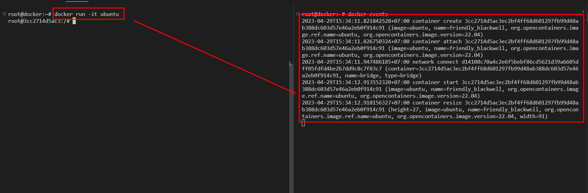

# 4. Docker image

# 1. Những điều cần biết:

- Docker Image: Là template để tạo ra các container. Tức các container được chạy từ các image này, khi các image này bị xóa đồng nghĩa với việc container sẽ không chạy được.
- Có 2 cách để tạo ra Image
    - Cách 1: Tạo một container, chạy các lệnh cần thiết cho container và sử dụng lệnh `docker commit` để tạo ra image mới. Cách này thường không được khuyến khích.
    - Cách 2: Viết một `Dockerfile` và thực thi nó để tạo ra một images. Cách này thường được sử dụng phổ biến để tạo ra image.
- Khi một container được tạo mới, Docker sẽ kéo các image từ Docker Hub về máy và thực hiện tạo container từ image đó.
- Tất cả mọi người đều có thể tạo ra image
- Docker hub có thành phần docker registry - được vận hành bởi công ty docker, nơi đây chứa các image mà người dùng chia sẻ.
- Các image là dạng file chỉ đọc (Read onle file). Khi tạo một container  mới, mỗi container sẽ thêm một lớp có thể ghi dữ liệu được gọi là Container-layer. Các thay đổi trên container như thêm, sửa, xóa file… sẽ được ghi trên lớp này. Do vậy, từ một image ban đầu, ta có thể tạo ra nhiều máy con mà chỉ tốt ít dung lượng ổ đĩa.
- Docker cung cấp 3 công cụ phân tán giúp chúng ta lưu trữ và quản lý các Docker Image. Để tự dựng một private registry và lưu trữ các private image chúng ta có thể sử dụng một trong các công cụ sau:
    - Docker Registry: Một opensource image distribution tool giúp lưu trữ và quản lý image
    - Docker Trusted Registry: một công cụ trả phí, nó khác với Docker Registry là có giao diện quản lý và cung cấp một số tính năng bảo mật
    - Docker Hub: Đây là một dịch vụ mà khi bạn không muốn quản lý registry. Cung cấp public và private image repository. Mặc định Docker client sẽ sử dụng docker hub nếu không có registry nào được cấu hình. Trên này có nhiều image official của các phần mềm.
- Quy tắc đặt tên image: `REPOSITORY[:TAG]`
    - Trong đó `TAG` là một phiên bản của images. Mặc định, khi không khai báo tag thì docker sẽ hiểu tag là `latest`

# 2. Một số lệnh làm việc với image

## 2.1 Kiểm tra hoạt động của docker

- Sử dụng lệnh `docker run hello-world` để kiểm tra hoạt động của docker trên host.

```jsx
docker run hello-world
```

- Lệnh trên sẽ gọi tới image tên là hello-world, đây là một image được lưu trên Docker Hub. Mục tiêu của image này là để kiểm tra hoạt động của docker được cài trên host đã ổn hay chưa.
- Kết quả như sau chứng tỏ docker đã hoạt động ổn định

```jsx
root@docker:~#  docker run hello-world

Hello from Docker!
This message shows that your installation appears to be working correctly.
```

## 2.2 Tìm kiếm các images từ docker Hub

- Sử dụng lệnh `docker seach` để tìm kiếm các image trên docker hub

```jsx
~#  docker search nginx
NAME                                              DESCRIPTION                                     STARS     OFFICIAL   AUTOMATED
nginx                                             Official build of Nginx.                        18433     [OK]       
unit                                              Official build of NGINX Unit: a polyglot app…   0         [OK]       
bitnami/nginx                                     Bitnami nginx Docker Image                      159                  [OK]
bitnami/nginx-ingress-controller                  Bitnami Docker Image for NGINX Ingress Contr…   25                   [OK]
```

- Tìm kiểm image với version:

```jsx
~#  docker search ubuntu:14.04
NAME                                 DESCRIPTION                                     STARS     OFFICIAL   AUTOMATED
devorbitus/ubuntu-bash-jq-curl       Based on Ubuntu:14.04 and only adding curl a…   0                    
leslau/nxlog                         nxlog ce image base on ubuntu:14.04             2                    [OK]
blacktobacco/ajenti                  Ajenti web hosting panel server based on Ubu…   7                    [OK]
pkubicki/atom-rc-base                Open SSH with SASS and RSYNC installed on Ub…   1                    
meedan/base                          meedan base image FROM ubuntu:14.04             0                    [OK]
```

- Trong đó:
    - Cột `NAME` : tên của images
    - Cột `DESCRIPTION`: Mô tả ngắn gọn của images
    - Cột `OFFICIAL`: Là images chính thức do công ty Docker cung cấp. Trạng thái là OK.

## 2.3 Tải image từ Docker Hub về host

- Ví dụ: Tải images có tên **netboxcommunity/netbox** về host

```jsx
~# docker pull netboxcommunity/netbox
```

Kết quả:

```jsx
root@docker:~# docker pull netboxcommunity/netbox  
Using default tag: latest
latest: Pulling from netboxcommunity/netbox
2ab09b027e7f: Already exists 
fef7a6fbf5cc: Pull complete 
e484fded3c8a: Pull complete 
f94361a33399: Pull complete 
b317d18cfcd7: Pull complete 
069b5d66886b: Pull complete 
e4a76c51252b: Pull complete 
3f72b05aafa4: Pull complete 
367bfd44af4d: Pull complete 
c272a7fb5088: Pull complete 
dea826b0ff81: Pull complete 
c6bc9be70532: Pull complete 
4f4fb700ef54: Pull complete 
3621d3046b87: Pull complete 
Digest: sha256:aa190433f1f404b62a89dfff2ca5f4c86f382d4b583f3fc709fa426376d4d23d
Status: Downloaded newer image for netboxcommunity/netbox:latest
docker.io/netboxcommunity/netbox:latest
```

## 2.4 Kiểm tra các image đang tồn tại

```jsx
docker images
```

Kết quả:

```jsx
root@docker:~# docker images
REPOSITORY    TAG       IMAGE ID       CREATED         SIZE
nginx         latest    6efc10a0510f   2 weeks ago     142MB
httpd         latest    4b7fc736cb48   2 weeks ago     145MB
busybox       latest    7cfbbec8963d   5 weeks ago     4.86MB
ubuntu        latest    08d22c0ceb15   7 weeks ago     77.8MB
hello-world   latest    feb5d9fea6a5   19 months ago   13.3kB
centos        latest    5d0da3dc9764   19 months ago   231MB
```

## 2.5 Tạo container từ images

Trong các tài liệu thường hay sử dụng lệnh `docker run hello-world`(`hello-world` là một image mặc định sau khi cài Docker) để chạy một container, sau khi chạy xong container này nó sẽ thoát. Tuy nhiên, đa số chúng ta lại cần tương tác nhiều hơn nữa với container (thao tác nhiều hơn).

Để chạy container và tương tác với container ta sử dụng tùy chọn `it` trong lệnh `docker run`. Ví dụ:

```jsx
docker run -it ubuntu
```

Kết quả:

```jsx
root@docker:~#  docker run -it ubuntu
root@d5ea3e0cfdef:/# cat /etc/os-release 
PRETTY_NAME="Ubuntu 22.04.2 LTS"
NAME="Ubuntu"
VERSION_ID="22.04"
VERSION="22.04.2 LTS (Jammy Jellyfish)"
VERSION_CODENAME=jammy
ID=ubuntu
ID_LIKE=debian
HOME_URL="https://www.ubuntu.com/"
SUPPORT_URL="https://help.ubuntu.com/"
BUG_REPORT_URL="https://bugs.launchpad.net/ubuntu/"
PRIVACY_POLICY_URL="https://www.ubuntu.com/legal/terms-and-policies/privacy-policy"
UBUNTU_CODENAME=jammy
```

• Trong ví dụ trên, lệnh `docker run -it ubuntu` sẽ tạo một container từ image có tên là `ubuntu` và tương tác luôn với nó. Lệnh `cat /etc/*release` sẽ hiển thị phiên bản container ở trên. Số `d5ea3e0cfdef`là ID của container

- Để hiện thị các thông tin về việc tạo container thực sử dụng lệnh `docker event` - Khi thực hiện các thao tác về docker thì màn hình sẽ hiển thị các sự kiện mà docker đang thực hiện.



```jsx
docker events
2023-04-29T15:34:11.821842528+07:00 container create 3cc2714d5ac3ec2bf4ff68d601297fb99d48ab388dc603d57e46a2eb0f914c91 (image=ubuntu, name=friendly_blackwell, org.opencontainers.image.ref.name=ubuntu, org.opencontainers.image.version=22.04)
2023-04-29T15:34:11.826750324+07:00 container attach 3cc2714d5ac3ec2bf4ff68d601297fb99d48ab388dc603d57e46a2eb0f914c91 (image=ubuntu, name=friendly_blackwell, org.opencontainers.image.ref.name=ubuntu, org.opencontainers.image.version=22.04)
2023-04-29T15:34:11.947486185+07:00 network connect d14108c70a4c2e6f5bebf86cd5621d39a6605dff05fdfd4be2b7dd9c8c7f83c7 (container=3cc2714d5ac3ec2bf4ff68d601297fb99d48ab388dc603d57e46a2eb0f914c91, name=bridge, type=bridge)
2023-04-29T15:34:12.913552320+07:00 container start 3cc2714d5ac3ec2bf4ff68d601297fb99d48ab388dc603d57e46a2eb0f914c91 (image=ubuntu, name=friendly_blackwell, org.opencontainers.image.ref.name=ubuntu, org.opencontainers.image.version=22.04)
2023-04-29T15:34:12.918156327+07:00 container resize 3cc2714d5ac3ec2bf4ff68d601297fb99d48ab388dc603d57e46a2eb0f914c91 (height=27, image=ubuntu, name=friendly_blackwell, org.opencontainers.image.ref.name=ubuntu, org.opencontainers.image.version=22.04, width=91)
```

- Sử dụng lệnh `docker attach ID_Container` để truy cập vào container sử dụng.

```jsx
root@docker:~# docker attach 3cc2714d5ac3
root@3cc2714d5ac3:/# hostname 
3cc2714d5ac3
root@3cc2714d5ac3:/#
```

## 3. Push - Pull Image bằng Docker Hub

- Để Push 1 image lên hub để chia sẻ với mọi người, Thì cần 1 tài khoản docker hub và login bằng câu lệnh.

```jsx
root@docker:~# docker login
Login with your Docker ID to push and pull images from Docker Hub. If you don't have a Docker ID, head over to https://hub.docker.com to create one.
Username: huydv398
Password: 
WARNING! Your password will be stored unencrypted in /root/.docker/config.json.
Configure a credential helper to remove this warning. See
https://docs.docker.com/engine/reference/commandline/login/#credentials-store

Login Succeeded
```

- Sau khi đăng nhập thành công tiến hành push image lên hub

```jsx

```